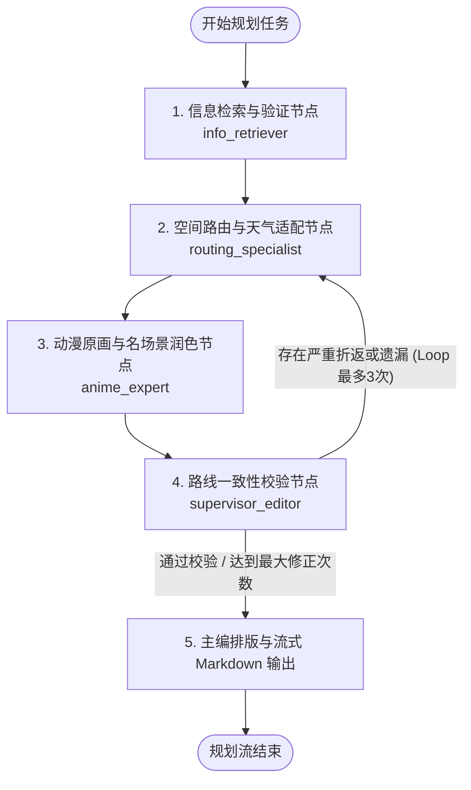
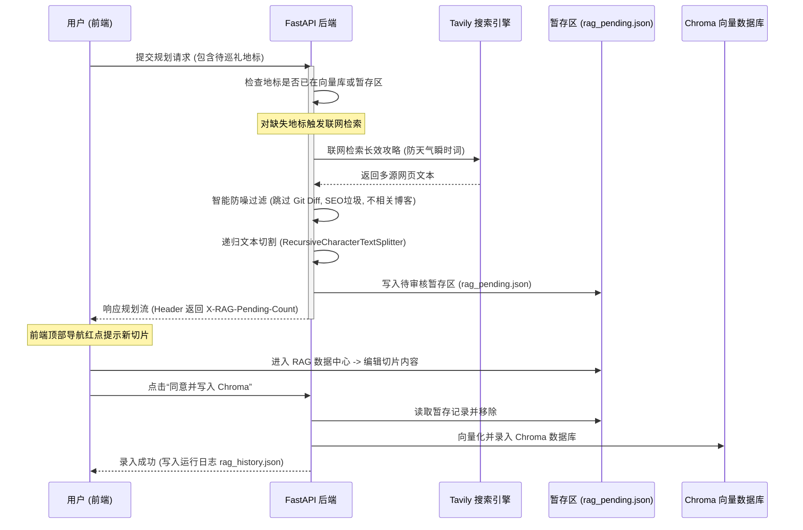

# 动漫圣地巡礼旅游规划系统 (Anime Travel Planner) 项目总结文档

本系统是一款专为动漫爱好者设计的**圣地巡礼路线规划工具**。它支持跨作品的动漫取景地浏览、收藏，并提供基于 **Turf.js 空间聚类**的本地路线规划，以及基于 **LangGraph 多智能体协同（含人机协同 RAG 增强检索）**的 AI 路线规划方案。

---

## 1. 项目架构与技术栈

本系统采用前后端分离的架构：

*   **前端 (Vite + Vue 3 SPA)**：
    *   **核心框架**：Vue 3 (Composition API, `<script setup>`)。
    *   **状态管理**：Pinia (采用单 Store [src/stores/app.js](file:///e:/yidapeixun/anime-travel/src/stores/app.js) 管理全局状态)。
    *   **UI 组件库**：Element Plus (通过 [vite.config.js](file:///e:/yidapeixun/anime-travel/vite.config.js) 中的 unplugin 插件实现自动按需导入)。
    *   **地图引擎**：原生 Leaflet (通过 `L.map()` 进行底图渲染、标记点聚合、连线绘制，**未使用** vue-leaflet 封装包)。
    *   **空间算法**：Turf.js (用于客户端本地的多日行程 K-Means 聚类及最近邻排序)。
*   **后端 (FastAPI + LangChain/LangGraph)**：
    *   **Web 框架**：FastAPI 提供 Web 服务，通过 StreamingResponse 支持 AI 规划的流式文字输出。
    *   **智能体框架**：LangGraph，通过多节点状态图（State Graph）实现多智能体协同（信息检索 -> 路线规划 -> 动漫细节润色 -> 合理性审查循环 -> 主编排版输出）。
    *   **向量检索 (RAG)**：ChromaDB 向量数据库，并集成了 **人机协同 (Human-in-the-Loop) 审核机制**。
    *   **大模型支持**：支持火山引擎 Ark API (云端模式)、LM Studio/Ollama (本地模式)、以及 DeepSeek API (智能体模式)。
    *   **数据源/网络检索**：
        *   Anitabi API：获取动漫作品的真实取景地经纬度、集数截图等。
        *   Bangumi API：动漫作品搜索。
        *   Tavily Search API：圣地巡礼网络攻略和场景的实时检索。
        *   wttr.in API：目的地实时天气获取。

---

## 2. 项目目录结构

项目的整体目录结构如下：

```text
anime-travel/
├── .env                              # 本地环境变量配置 (LLM 密钥、Tavily 密钥等)
├── .gitignore                        # Git 忽略配置
├── pyproject.toml                    # Python 依赖配置文件 (使用 uv 管理)
├── package.json                      # 前端 Node.js 依赖配置文件
├── vite.config.js                    # Vite 配置文件 (配置代理规则及 Element Plus 自动导入)
├── index.html                        # 前端单页面入口
├── server.py                         # FastAPI 后端入口，提供规划流式生成及 RAG 数据中心 API
├── agent.py                          # 基于 LangGraph 的多智能体流式规划逻辑实现
├── tools.py                          # 智能体工具库 (天气查询、景点推荐、动漫名场面检索)
├── rag_service.py                    # RAG 增强检索核心服务 (包含联网检索、暂存队列、向量管理、双阶段检索重排)
├── chroma_db/                        # Chroma 向量数据库本地持久化目录
│   ├── rag_pending.json              # [自动生成] 人机协同待审核切片暂存文件
│   └── rag_history.json              # [自动生成] RAG 模块运行事件历史日志
├── src/                              # 前端 Vue 3 源码目录
│   ├── main.js                       # 前端入口文件 (初始化 Vue、Pinia、Element Plus)
│   ├── App.vue                       # 主布局组件 (负责地图/侧边栏与 RAG 数据中心的切换)
│   ├── style.css                     # 全局样式文件 (含 Leaflet 弹窗覆盖样式、多日路线颜色标记)
│   ├── stores/
│   │   └── app.js                    # 全局单一 Pinia 状态管理 store
│   ├── utils/
│   │   ├── api.js                    # Anitabi/Bangumi API 封装，以及 3 种 AI 规划方案调用
│   │   └── routePlanner.js           # Turf.js 本地 K-Means 空间聚类与最近邻 TSP 算法
│   └── components/
│       ├── SearchPanel.vue           # 侧边栏顶部：作品搜索与 AI 参数设置对话框
│       ├── CoordinateLibrary.vue     # 侧边栏底部：收藏夹 (坐标库)、历史规划记录及 AI 流式输出展示
│       ├── MapView.vue               # 核心地图组件：Leaflet 交互、打卡标记、多日路线、图像对比组件
│       ├── LandmarkDock.vue          # 底部浮动栏：横向滑动的地标卡片流，支持快速定位与收藏
│       ├── ItineraryPanel.vue        # 客户端本地规划的行程卡片列表
│       ├── RagAdminPanel.vue         # RAG 数据中心全屏管理面板 (待审核、已入库、运行日志、召回测试)
│       ├── LandmarkList.vue          # [未使用] 备用地标列表组件 (保留中)
│       ├── LandmarkPopup.vue         # [未使用] 地图弹窗组件 (MapView 中使用原生 HTML 字符串模板构建弹窗)
│       └── RagConsole.vue            # [未使用] 旧版 RAG 监控台组件
```

---

## 3. 核心功能及实现细节

### 3.1 三种 AI 路线规划方案
用户可以在 [SearchPanel.vue](file:///e:/yidapeixun/anime-travel/src/components/SearchPanel.vue) 的“AI 设置”对话框中自由切换以下三种路线规划方案（配置自动持久化到浏览器的 `localStorage`）：

1.  **云端方案 (Cloud)**：
    *   通过前端直接请求配置的兼容 OpenAI 规范的云端 LLM 端点（默认指向火山引擎 Ark 平台 `/ark/bots/chat/completions`）。
    *   Vite 代理将请求转发至火山引擎 API 服务。
2.  **本地方案 (Local)**：
    *   直接调用本地部署的大模型（如 Ollama / LM Studio），默认接口为 `http://localhost:11434/v1/chat/completions`。
3.  **Python 智能体方案 (Agent)**：
    *   **核心功能**：调用本地 FastAPI 后端的 `/api/agent/plan` 流式接口。
    *   **实现流式状态反馈**：为了解决大模型耗时长、规划框长时间空白的痛点，[agent.py](file:///e:/yidapeixun/anime-travel/agent.py) 会在后台运行各节点时，向流中输出以 `__STATUS__:` 开头的进度标识。前端 [CoordinateLibrary.vue](file:///e:/yidapeixun/anime-travel/src/components/CoordinateLibrary.vue) 实时拦截该标识，渲染成动态的加载步骤条，确保用户感知 AI 的每一步动作。

### 3.2 LangGraph 多智能体规划图
在 **Agent 方案**中，后端基于 LangGraph 构建了一个流式的多智能体协同网络，各节点职责如下：



*   **`info_retriever_node` (信息检索与验证)**：
    *   从输入中解析出需要访问的地标。
    *   优先读取 RAG 中的本地知识数据填充 `rag_info`。
    *   针对未缓存的地标，调用 Tavily 联网检索，并通过一个判定 Prompt 过滤掉广告及无关网页，提取出名场面背景和打卡攻略。
*   **`routing_specialist_node` (空间路由)**：
    *   识别目标地标所在的日本主城市，通过 `wttr.in` 获取当地天气。
    *   计算经纬度距离，按地理区域对地标分组，设计路线顺序，确保每天单日步行在合理范围内。
*   **`anime_expert_node` (动漫细节润色)**：
    *   微调路线顺序以配合原作中的时间氛围（如大吉山在黄昏游览，车站夜景等）。
    *   补充拍照姿势建议、经典台词还原以及打卡圣地礼仪。
*   **`supervisor_editor_node` (路线审查校验)**：
    *   核对是否有遗漏的地标、是否存在“同城大跨度严重折返”以及步行距离是否超负荷。
    *   如果校验不通过，将记录错误信息并**回退打回**至 `routing_specialist_node` 重新分配（最多修正 3 次）。
    *   审查通过后，由资深主编角色（Editor）将包含所有名场面、摄影机位和交通工具的方案渲染为富有动漫情怀的精美 Markdown，并以流式输出至前端。

### 3.3 人机协同 (Human-in-the-Loop) RAG 增强检索系统
系统集成了一套安全、高可用的人机协作 RAG 流程，有效规避了 AI 直接联网检索带来的幻觉和数据噪点问题。



#### RAG 系统核心技术实现：
1.  **联网智能防噪检索**：
    *   在 [rag_service.py](file:///e:/yidapeixun/anime-travel/rag_service.py) 中，系统仅抓取长效背景攻略，规避包含天气等瞬时动态变化的词汇。
    *   设置严格的 URL/内容黑名单，排除 HuggingFace 示例、GitHub 提交记录、Git Diff 块、代码示例以及与动漫/旅游无关的 SEO 垃圾页面。
2.  **自适应向量提取 (Fallback Embeddings)**：
    *   [FallbackEmbeddings](file:///e:/yidapeixun/anime-travel/rag_service.py#L53) 类优先尝试通过本地连接 LM Studio 托管的 Embedding 模型（例如 `text-embedding-qwen3-embedding-0.6b`）；
    *   若本地服务未启动，将自动平滑降级为 Chroma 数据库内建的本地 CPU ONNXMiniLM 嵌入函数，防止系统发生崩溃崩溃。
3.  **大模型 Logits 概率预测精排 (Reranker)**：
    *   [LMStudioReranker](file:///e:/yidapeixun/anime-travel/rag_service.py#L107) 会召回向量库相似度最接近的 6 个候选切片。
    *   通过向本地精排大模型（例如 `qwen3-reranker-0.6b`）输入判定 Prompt，并配置参数 `include: ["message.output_text.logprobs"]` 提取首个 Token 的对数概率。
    *   使用公式：$$\text{Score} = \frac{P(\text{Yes})}{P(\text{Yes}) + P(\text{No})} \times 10.0$$ 计算得出 $0.0 - 10.0$ 的精确得分。
    *   系统仅截取得分最高的前 3 名（Top 3）注入 Agent 节点上下文。精排接口异常时自动降级为向量原生相似度排序，确保高可用。
4.  **人机协同审核后台 (RagAdminPanel)**：
    *   用户在全屏管理后台中对抓取回来的知识分块进行可视化编辑、新增或直接拒绝（Reject）。
    *   审核通过后，数据写入 ChromaDB 库。支持在召回测试中输入任意查询词测试 Recall 和 Rerank 打分效果，并随时可以通过“运行日志”面板查阅每一次录入和召回的系统日志。

### 3.4 客户端本地空间聚类与排序
当用户在前端导入某部动漫（如《你的名字。》）并在地图中勾选部分地标进行规划时，若不选择 AI 规划，系统可以使用纯前端的地理聚类生成方案：
*   **聚类算法**：使用 `@turf/turf` 的 K-Means 空间聚类方法将所有勾选点按照坐标分布划分为多天。
*   **路线排序**：基于最近邻贪心算法（TSP 极简求解），以作品在 Anitabi 中返回的初始地理中心（或行程的第一点）为起点，依次选择距离当前点最近的下一个未访问点进行排序，避免在地图上绘制出杂乱交错的路线线段。

---

## 4. 使用方法与启动指南

### 4.1 环境变量配置
在项目根目录下创建 `.env` 文件，输入以下配置：

```env
# 核心大模型生成配置 (火山引擎 API 密钥)
VITE_ARK_API_KEY=your_volcengine_ark_api_key

# 后端 Agent 模式所需 API 密钥
DEEPSEEK_API_KEY=your_deepseek_api_key
TAVILY_API_KEY=your_tavily_search_api_key

# 本地 LM Studio / Ollama 配置 (RAG 向量嵌入与精排)
EMBEDDING_BASE_URL=http://localhost:1234/v1
RERANK_BASE_URL=http://localhost:1234/v1
```

### 4.2 前端启动步骤
1.  确保系统已安装 Node.js (推荐 v18+)。
2.  在项目根目录下安装依赖：
    ```bash
    npm install
    ```
3.  启动 Vite 局部开发服务器：
    ```bash
    npm run dev
    ```
4.  打开浏览器访问页面：`http://localhost:5173`。

### 4.3 后端启动步骤
推荐使用高效的 Python 虚拟环境管理器 `uv`（也可以直接使用原生 pip 虚拟环境）：

1.  在根目录下创建虚拟环境并安装包依赖：
    ```bash
    # 使用 uv 快速同步 pyproject.toml 依赖
    uv sync
    ```
2.  启动 FastAPI 后端服务，使其运行在本地 8000 端口：
    ```bash
    uv run uvicorn server:app --host 127.0.0.1 --port 8000 --reload
    ```
    *(Vite 服务已在 [vite.config.js](file:///e:/yidapeixun/anime-travel/vite.config.js) 中配置好代理，前端对 `/api` 的请求会被自动转发至后端)*

### 4.4 本地 RAG 模型环境启动 (LM Studio)
若想完美使用后端 RAG 双阶段检索重排：
1.  下载安装 LM Studio 软件。
2.  下载并在模型库中加载以下两个轻量化模型：
    *   向量生成模型：`text-embedding-qwen3-embedding-0.6b` (用于计算文本嵌入)。
    *   重排序判定模型：`qwen3-reranker-0.6b` (作为交叉编码器精排)。
3.  在 LM Studio 侧边栏开启 Local Server，监听默认端口 `1234`（如果在自定义端口运行，请修改 `.env` 中的 `EMBEDDING_BASE_URL` 和 `RERANK_BASE_URL`）。

---

## 5. 注意事项与开发规约

1.  **地图组件只允许使用原生 Leaflet API**：
    *   [MapView.vue](file:///e:/yidapeixun/anime-travel/src/components/MapView.vue) 直接使用 `L.map()` 实例化，**不要**混用 Vue Leaflet 组件封装包。
    *   地图上的地标弹窗信息卡片也是直接通过原生拼接 HTML 字符串模板传递给 Leaflet Popup。在 MapView 组件内通过 [src/components/LandmarkPopup.vue](file:///e:/yidapeixun/anime-travel/src/components/LandmarkPopup.vue) 渲染是不起作用的（属于预存的模板文件）。
2.  **单一 Pinia Store 规约**：
    *   系统所有的状态（动漫数据、搜索结果、坐标库收藏、对比图弹窗数据、AI 运行状态配置）必须统一声明在 [src/stores/app.js](file:///e:/yidapeixun/anime-travel/src/stores/app.js) 中。
    *   严禁在各个子组件中随意声明非临时性的复杂状态，任何跨组件交互都应通过 Pinia Store 进行数据流调度。
3.  **Element Plus 自动导入避坑**：
    *   由于配置了 unplugin-auto-import 插件，任何 Element Plus 组件（如 `el-button`、`el-dialog`、`el-input`）在前端模板中均直接使用即可，**无需**且**不要**在 Script 中手动书写 `import { ElButton } from 'element-plus'`，这会导致样式覆盖或重复构建。
4.  **已知未引用或冗余的冗余文件**：
    *   [src/components/LandmarkList.vue](file:///e:/yidapeixun/anime-travel/src/components/LandmarkList.vue)：为旧版地标展示遗留，现处于未使用状态。
    *   [src/components/LandmarkPopup.vue](file:///e:/yidapeixun/anime-travel/src/components/LandmarkPopup.vue)：目前地图交互已完全切换为 MapView 内部的原生 HTML 字符串构建，该文件保留作为备份，目前未在任何地方引用。
    *   [src/components/RagConsole.vue](file:///e:/yidapeixun/anime-travel/src/components/RagConsole.vue)：旧版 RAG 简易控制台，新版功能已完全集成进全屏的 [RagAdminPanel.vue](file:///e:/yidapeixun/anime-travel/src/components/RagAdminPanel.vue)。
5.  **滚动冲突与容器布局**：
    *   侧边栏和管理面板中的日志记录卡片在布局上采用了 Flex 列式排布。请严格遵循布局高度约束规范，控制主体 `overflow-y: auto` 滚动，避免出现双滚动条及在小屏幕下内容被挤压的 Flexbox 塌陷问题。
