# 动漫圣地巡礼旅游规划 — 系统架构图

## 系统整体架构图

```mermaid
%%{init: {'theme': 'base', 'themeVariables': { 'primaryColor': '#1a1a2e', 'primaryTextColor': '#e0e0e0', 'lineColor': '#F8F8F8', 'secondaryColor': '#16213e' }}}%%
graph TB
    %% ==================== 样式定义 ====================
    classDef viewLayer fill:#1a3a5c,stroke:#4a9eff,stroke-width:2px,color:#e0e8f0
    classDef stateLayer fill:#3a2a5c,stroke:#b37feb,stroke-width:2px,color:#e8e0f0
    classDef dataLayer fill:#2a4a3c,stroke:#67C23A,stroke-width:2px,color:#e0f0e8
    classDef external fill:#4a2a2a,stroke:#F56C6C,stroke-width:2px,color:#f0e0e0
    classDef userAction fill:#5a4a2a,stroke:#E6A23C,stroke-width:2px,color:#f0e8d0

    %% ==================== 视图层 (View Layer) ====================
    subgraph ViewLayer["视图层 — View Layer (Vue 3 SPA)"]
        direction TB
        App["App.vue<br/>主入口布局"] :::viewLayer

        subgraph Components["核心组件"]
            SP["SearchPanel.vue<br/>🔍 作品搜索栏<br/>- 关键词/Bangumi ID 搜索<br/>- AI 方案切换与参数设置"] :::viewLayer
            CL["CoordinateLibrary.vue<br/>📋 坐标库 + 历史记录<br/>- 地标勾选管理<br/>- AI 行程渲染(Markdown)<br/>- 路线历史存取"] :::viewLayer
            MV["MapView.vue<br/>🗺️ Leaflet 地图<br/>- 地标标注/弹窗<br/>- 路线折线绘制<br/>- 截图对比叠加层<br/>- 图源切换(CartoDB/高德)"] :::viewLayer
            LD["LandmarkDock.vue<br/>📎 底部地标 Dock<br/>- 选中地标横向滚动<br/>- 生成路线前检查"] :::viewLayer
        end

        App --> SP
        App --> CL
        App --> MV
        App --> LD
    end

    %% ==================== 状态层 ====================
    subgraph StateLayer["状态层 — Pinia Store (stores/app.js)"]
        direction TB
        Store["useAppStore()<br/>单一状态树"] :::stateLayer

        subgraph StateDomains["状态域划分"]
            Anime["🎬 当前作品<br/>bangumi / points / searchResults"]
            Map["🗺️ 地图交互<br/>selectedPointId / compareData"]
            Route["📐 客户端路线<br/>itinerary / days"]
            Library["📚 坐标库<br/>coordinateLibrary / libraryAiResponse / generatedLandmarks"]
            History["📜 历史记录<br/>routeHistory (localStorage)"]
            AI["🤖 AI配置<br/>aiConfig (3种方案)<br/>persisted to localStorage"]
            UI["⚙️ 全局UI<br/>loading / error / showAdminPage"]
        end
    end

    %% ==================== 数据处理层 ====================
    subgraph DataLayer["数据处理层 — Data Processing Layer"]
        direction TB

        subgraph API["① 数据接口模块 (api.js)"]
            bangumiAPI["fetchBangumiLite<br/>fetchBangumiPointsDetail<br/>→ Anitabi 巡礼地数据"]
            searchAPI["searchBangumiByKey<br/>→ Bangumi搜索API"]
            aiAPI["generateAIRoute<br/>→ AI路线生成<br/>(Cloud/Local/Agent三类)"]
        end

        subgraph Geo["② 空间计算模块 (routePlanner.js)"]
            turf["Turf.js K-means聚类<br/>+ 最近邻排序<br/>planRoute()"]
        end

        subgraph LLM["③ 大语言模型方案"]
            direction TB
            Cloud["☁️ Cloud (Ark API)<br/>/ark/bots/chat/completions<br/>→ Volcengine 豆包"]
            Local["💻 Local (LM Studio/Ollama)<br/>→ localhost:11434<br/>deepseek-r1:7b"]
            Agent["🤖 Agent (LangGraph)<br/>→ /api/agent/plan<br/>→ Python FastAPI 后端"]
        end
    end

    %% ==================== Python Agent 后端详情 ====================
    subgraph Backend["Python Agent 后端 (server.py + agent.py)"]
        direction TB
        FastAPI["FastAPI Server<br/>uvicorn :8000"] :::dataLayer

        subgraph AgentPipeline["LangGraph Agent Pipeline (MultiAgentRunnable)"]
            direction LR
            A1["info_retriever<br/>解析地标 + RAG/联网检索<br/>+ MiMo视觉分析"] :::dataLayer
            A2["routing_specialist<br/>地理路由 + 天气适配<br/>K-means分组"] :::dataLayer
            A3["anime_expert<br/>名场面时段匹配<br/>拍照还原指南"] :::dataLayer
            A4["supervisor_editor<br/>合理性审查(<=3次修正)<br/>→ Markdown终稿"] :::dataLayer
        end

        subgraph AgentTools["Agent Tools"]
            T1["get_anime_scene<br/>Tavily搜索"] :::dataLayer
            T2["get_weather<br/>wttr.in天气"] :::dataLayer
            T3["analyze_anime_scene_image<br/>MiMo视觉模型"] :::dataLayer
        end

        subgraph RAG["RAG知识库 (ChromaDB)"]
            RAG_Ingest["增量联网检索 → 切片入库"] :::dataLayer
            RAG_Recall["向量召回 + BGE Rerank重排"] :::dataLayer
            RAG_Pending["待审核暂存队列"] :::dataLayer
        end

        FastAPI --> AgentPipeline
        AgentPipeline --> AgentTools
        AgentPipeline -.-> RAG
    end

    %% ==================== 外部服务 ====================
    subgraph External["外部服务 & API"]
        Anitabi["Anitabi API<br/>巡礼取景地数据"] :::external
        Bangumi["Bangumi API (bgm.tv)<br/>作品信息搜索"] :::external
        Volcengine["Volcengine Ark API<br/>豆包大模型"] :::external
        DeepSeek["DeepSeek API<br/>agent推理模型"] :::external
        Tavily["Tavily Search API<br/>联网检索"] :::external
    end

    %% ==================== 用户操作 ====================
    UserAction("👤 用户操作") :::userAction

    %% ==================== 数据流连接 ====================

    %% 用户 → 视图
    UserAction -->|"输入作品名 / 点击地标 / 配置AI"| SP
    UserAction -->|"勾选地标 / 生成路线"| CL
    UserAction -->|"点击地图标记 / 切换图源"| MV
    UserAction -->|"检查选中地标"| LD

    %% 视图 → Store (写操作)
    SP -->|"searchBangumi / searchByKey / updateAiConfig"| Store
    CL -->|"addToLibrary / toggleCheck / generateLibraryItinerary"| Store
    MV -->|"selectPoint / setCompareData"| Store

    %% Store → 视图 (读/响应)
    Store -->|"bangumi / points 更新"| MV
    Store -->|"itinerary / days 更新"| MV
    Store -->|"coordinateLibrary 更新"| CL
    Store -->|"checkedPoints 更新"| LD
    Store -->|"aiConfig 更新"| SP

    %% Store → 数据处理
    Store -->|"points + days"| Geo
    Store -->|"librarySelected + libraryDays + aiConfig"| LLM

    %% 数据处理 → 外部
    API --> Anitabi
    API --> Bangumi
    LLM -->|Cloud方案| Volcengine
    AgentPipeline -->|LangGraph编排| DeepSeek
    AgentTools --> Tavily

    %% API → Store (数据回填)
    bangumiAPI -->|"巡礼点数据"| Anime
    searchAPI -->|"搜索结果"| Anime
    aiAPI -->|"路线结果"| Library

    %% 数据处理 → 视图 (Turf.js路线 → 地图)
    Geo -->|"planRoute() 结果"| Route
    Route -->|"itinerary 更新"| MV

    %% Agent后端内部流程 (实线调用 / 虚线数据)
    AgentPipeline -->|"调用"| AgentTools
    AgentPipeline <-->|"RAG 召回/入库"| RAG

    %% 代理后端调用外部
    DeepSeek -->|"agent推理"| AgentPipeline

    %% ==================== 数据持久化 ====================
    subgraph Persistence["数据持久化"]
        LS["localStorage<br/>- ai-config<br/>- route-history"] :::external
        Chroma["ChromaDB (向量库)<br/>- 文本切片 + embeddings"] :::external
    end

    History -->|"读写"| LS
    RAG -->|"读写"| Chroma

    %% ==================== 图例 ====================
    subgraph Legend["图例"]
        L1(["视图层 (Vue 3 组件)"]) :::viewLayer
        L2(["状态层 (Pinia Store)"]) :::stateLayer
        L3(["数据处理层"]) :::dataLayer
        L4(["外部服务"]) :::external
    end
```

---

## 核心业务流程图

```mermaid
sequenceDiagram
    participant User as 用户
    participant View as 视图层
    participant Store as Pinia Store
    participant Data as 数据处理层
    participant External as 外部服务

    rect rgb(26, 58, 92)
        Note over User,External: 🅰️ 作品信息获取
        User->>View: 输入关键词/Bangumi ID
        View->>Store: dispatch searchByKey / searchBangumi
        Store->>Data: 调用 API 模块
        Data->>External: Bangumi 搜索 / Anitabi 取景地
        External-->>Data: 返回作品元数据 + 地标Geo列表
        Data-->>Store: 更新 bangumi + points
        Store-->>View: 地图标注 + Dock 展示
    end

    rect rgb(42, 42, 74)
        Note over User,External: 🅱️ 客户端路线规划 (Turf.js)
        User->>View: 勾选地标 + 设置天数
        View->>Store: toggleCheck + set days
        User->>View: 点击"生成路线"
        View->>Store: dispatch generateItinerary
        Store->>Data: planRoute(points, days)
        Data->>Data: K-means 聚类 + 最近邻排序
        Data-->>Store: itinerary[] (每日地标排序)
        Store-->>View: 地图绘制折线 + 分配 day-color
    end

    rect rgb(58, 42, 74)
        Note over User,External: 🅲 AI 路线规划 (混合方案)
        User->>View: 设置 AI 方案 (Cloud/Local/Agent)
        View->>Store: updateAiConfig → localStorage
        User->>View: 点击"AI 生成行程"
        View->>Store: dispatch generateLibraryItinerary
        Store->>Data: generateAIRoute(days, landmarks, config)

        alt Cloud 方案
            Data->>External: POST /ark/bots → Volcengine 豆包
            External-->>Data: 完整 Markdown 行程
        else Local 方案
            Data->>External: POST localhost:11434 → Ollama
            External-->>Data: 完整 Markdown 行程
        else Agent 方案 (LangGraph)
            Data->>External: POST /api/agent/plan → FastAPI
            External->>External: LangGraph Pipeline (4个节点)
            Note over External: info_retriever →<br/>Tavily 联网检索 + RAG 召回<br/>+ MiMo 视觉分析
            Note over External: routing_specialist →<br/>地理路由 + 天气适配
            Note over External: anime_expert →<br/>名场面时段 + 拍照指南
            Note over External: supervisor_editor →<br/>合理性审查(≤3轮修正)<br/>→ Markdown 终稿
            External-->>Data: 流式 Markdown 行程
        end

        Data-->>Store: libraryAiResponse += chunk
        Store-->>View: 实时渲染 Markdown
        Store->>Store: saveRouteHistory → localStorage
    end
```



---

## 关键模块对应关系表

| 功能域 | 视图层 | 状态层 (Store 域) | 数据处理层 | 外部依赖 |
|--------|--------|-------------------|------------|----------|
| **作品搜索** | `SearchPanel` | `searchResults`, `searching` | `searchBangumiByKey()` | Bangumi API (bgm.tv) |
| **巡礼数据获取** | `SearchPanel` | `bangumi`, `points` | `fetchBangumiLite()`, `fetchBangumiPointsDetail()` | Anitabi API |
| **客户端路线** | `MapView` (折线) | `itinerary`, `days` | `planRoute()` (Turf.js K-means + 最近邻) | Turf.js (本地计算) |
| **AI Cloud路线** | `CoordinateLibrary` | `libraryAiResponse` | `generateAIRoute()` → `/ark/bots` | Volcengine Ark 豆包 |
| **AI Local路线** | `CoordinateLibrary` | `libraryAiResponse` | `generateAIRoute()` → `localhost:11434` | Ollama / LM Studio |
| **AI Agent路线** | `CoordinateLibrary` | `libraryAiResponse` | `generateAIRoute()` → `/api/agent/plan` | FastAPI + LangGraph + DeepSeek |
| **Agent-联网检索** | (后端) | — | `get_anime_scene` (Tavily) | Tavily Search API |
| **Agent-视觉分析** | (后端) | — | `analyze_anime_scene_image` (MiMo) | MiMo v2.5 视觉模型 |
| **Agent-RAG知识库** | `RagAdminPanel` | — | ChromaDB 向量召回 + BGE Rerank | 本地 ChromaDB |
| **地标收藏** | `CoordinateLibrary` | `coordinateLibrary` | 纯状态管理（无数据处理） | localStorage |
| **地图展示** | `MapView` | `selectedPointId`, `compareData` | 纯 Leaflet 操作（无数据处理） | Leaflet + CartoDB/高德瓦片 |
| **路线历史** | `CoordinateLibrary` | `routeHistory` | 纯序列化/反序列化 | localStorage |

---

*生成于 2026-06-08，基于项目源代码 v2 (commit: 19d513b)*
